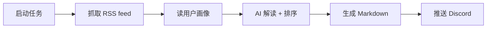
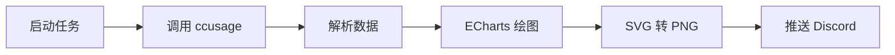
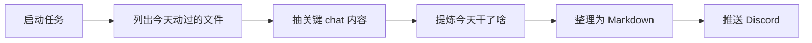
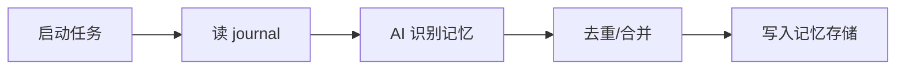
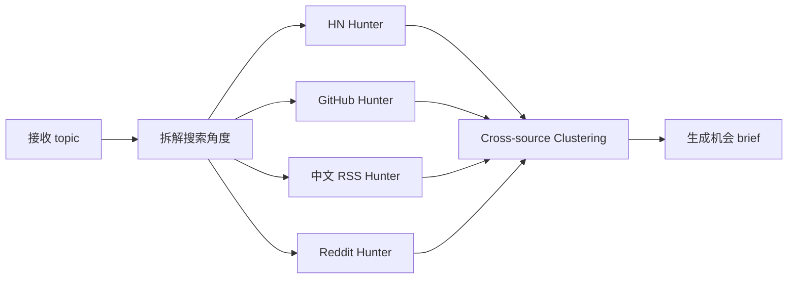

# 定时任务系统文档

> Pi Discord Agents 定时任务调度系统总览

## 📋 目录

- [架构概览](#架构概览)
- [调度器核心](#调度器核心)
- [定时任务清单](#定时任务清单)
- [任务详细说明](#任务详细说明)
- [手动触发](#手动触发)
- [配置与维护](#配置与维护)

---

## 架构概览

### 设计原则

- **轻量无依赖**: 不使用 `node-cron`，规避 launchd 频繁重启状态丢失
- **时区友好**: 默认北京时间 (UTC+8)，支持自定义时区
- **容错机制**: 错过的任务在 1 小时内会补跑
- **去重保护**: 同一天同一任务只执行一次

### 技术栈

```
调度器: src/scheduler.mjs (setInterval + 时分比对)
任务定义: src/jobs/*.mjs
任务注册: src/entry-bot.mjs
```

### 工作流程

```
┌─────────────┐     ┌──────────────┐     ┌─────────────┐
│ Scheduler   │────▶│ Job Runner   │────▶│ Discord/FS  │
│ (30s tick)  │     │ (Pi Prompt)  │     │ (Output)    │
└─────────────┘     └──────────────┘     └─────────────┘
```

---

## 调度器核心

### 文件位置

```
src/scheduler.mjs
```

### 核心参数

| 参数 | 默认值 | 说明 |
|-----|--------|------|
| `tickIntervalMs` | 30,000 | 调度器轮询间隔（毫秒） |
| `MISSED_GRACE_MS` | 3,600,000 | 错过任务补跑窗口（1 小时） |

### API 方法

```javascript
const sched = createScheduler({ log, tickIntervalMs });

// 注册任务
sched.register({
  id: 'job-id',
  hour: 12,
  minute: 0,
  tzOffsetHours: 8,
  run: async ({ dateKey }) => { /* 任务逻辑 */ }
});

// 启动调度器
sched.start();

// 列出所有任务
sched.list();

// 停止调度器
sched.stop();
```

### 时间计算逻辑

```javascript
// 目标时区时间计算
function nowInTz(tzOffsetHours) {
  const now = new Date();
  const utcMs = now.getTime() + now.getTimezoneOffset() * 60_000;
  const tzMs = utcMs + tzOffsetHours * 3600_000;
  const d = new Date(tzMs);
  return {
    dateKey: `${yyyy}-${mm}-${dd}`,
    hm: `${hh}:${mi}`,
    hh: d.getUTCHours(),
    mi: d.getUTCMinutes()
  };
}
```

---

## 定时任务清单

| 任务 ID | 触发时间 | 时区 | 频率 | 输出位置 | 状态 |
|---------|---------|------|------|---------|------|
| `rss-daily` | 12:00 | UTC+8 | 每日 | Discord #📰 资讯 + `data/rss/` | ✅ 激活 |
| `token-usage` | 12:30 | UTC+8 | 每日 | Discord #📊 用量 + `data/token-usage/` | ✅ 激活 |
| `gh-todo-daily` | 10:00 | UTC+8 | 每日 | Discord #🚧 每日任务 | ✅ 激活 |
| `daily-summary` | 23:00 | UTC+8 | 每日 | Discord #🌙 每日总结 + `data/daily-summary/` | ✅ 激活 |
| `distillation-daily` | 23:30 | UTC+8 | 每日 | `data/memory/` | ✅ 激活 |
| `memory-governance-weekly` | 周日 02:00 | UTC+8 | 每周 | `data/memory/` | ✅ 激活 |
| `memory-quality-weekly` | 周日 03:00 | UTC+8 | 每周 | `data/memory/` | ✅ 激活 |
| `opportunity` | 手动 | - | 按需 | Discord #🎯 机会 + `data/opportunity/` | 🔄 可用 |

---

## 任务详细说明

### 1️⃣ RSS 资讯日报 (`rss-daily`)

**文件**: `src/jobs/rss-daily.mjs`

**触发时间**: 每日 12:00 北京时间

**数据源**: 42 个 RSS/Atom feed

**工作流程**:



**RSS 源覆盖**:
- Hugging Face
- OpenAI
- Cloudflare
- Anthropic
- AI/Agent/研究
- 出海 SaaS
- 图片/媒体/视频
- 中文媒体
- GitHub/工具栈
- 通用科技/ML

**输出格式**:

```markdown
# RSS 资讯日报 · YYYY-MM-DD

> 画像驱动 / 北京时间 12:00 推送 / 数据源 42 个 RSS / Atom feed

## 今日要点(3~5 条)
1. **<标题>** — <一句话> · 源:<layer> · relevance:high

## Hugging Face
## OpenAI
## Cloudflare
...

## 一句话洞察
<核心信号一句话>
```

**输出位置**:
- Discord: `#📰 资讯` 频道
- 本地: `data/rss/YYYY-MM-DD.md`

**硬约束**:
- ✅ 必须用中文
- ❌ Markdown 内容里不用 emoji
- ✅ 只用 `src/rss-fetcher.mjs` 抓数据
- ❌ 禁止 web_search / web_fetch / Ollama

---

### 2️⃣ Token 用量统计 (`token-usage`)

**文件**: `src/jobs/token-usage.mjs`

**触发时间**: 每日 12:30 北京时间

**数据源**:
- `ccusage daily/session/monthly --json --offline` (优先)
- 本地 `sessions/*.jsonl` (备选)

**工作流程**:



**可视化内容** (6 子图):
1. 日用量趋势图 (最近 14 天)
2. 模型分布饼图
3. Agent 分布柱状图
4. 成本趋势图
5. 消息量统计
6. 缓存命中率

**输出格式**:
- Discord: ECharts 渲染的 PNG 大图
- 本地: `data/token-usage/YYYY-MM-DD.{md,png,svg}`

**技术实现**:
- ECharts 5 SSR 模式 (`renderer: 'svg' + ssr: true`)
- `@resvg/resvg-js` 把 SVG → PNG (纯 Rust 绑定)
- 不依赖 DOM，纯 Node.js 运行

---

### 3️⃣ GitHub 待办列表 (`gh-todo-daily`)

**文件**: `scripts/push-gh-list.mjs`

**触发时间**: 每日 10:00 北京时间

**工作方式**: 独立子进程运行

```javascript
const child = spawn('node', ['scripts/push-gh-list.mjs']);
```

**输出位置**: Discord `#🚧 每日任务` 频道

---

### 4️⃣ 每日总结 (`daily-summary`)

**文件**: `src/jobs/daily-summary.mjs`

**触发时间**: 每日 23:00 北京时间

**数据源**:
- `~/.workbuddy/logs/` - workbuddy 工具日志
- `~/.workbuddy/memory/` - workbuddy 记忆
- `~/.zcode/v2/` - zcode 会话目录
- `~/.pi/agent/sessions/` - Pi Agent 会话
- `~/.claude/history.jsonl` - Claude Code 主历史
- `~/.claude/sessions/` - Claude Code sessions
- `~/.gemini/antigravity/` - gemini antigravity
- `~/.kiro/` - kiro 项目配置

**工作流程**:



**分析维度**:
- 🛠 主要工作 (3~8 条)
- 💡 主要决定
- 🚧 阻塞/待办
- 📚 学到的/新坑
- 🔁 反复模式 (自动化候选)

**输出格式**:

```markdown
# 每日总结 · YYYY-MM-DD

> 数据源: ~/.workbuddy / ~/.zcode / ~/.pi / ~/.gemini / ~/.kiro / ~/.claude
> 生成时间: 北京时间 23:00 · 由 Pi Agent 自动汇总

## 今日概览(2~3 句)
<今天整体的画像>

## 🛠 主要工作
1. **<条目>** — <一句话描述> · 项目: <项目名>

## 💡 主要决定
- <决定 1>: <原因>

## 🚧 阻塞 / 待办(明天继续)
- [ ] <阻塞 1>

## 📚 学到的 / 新坑
- <点 1>

## 🔁 反复模式(自动化候选)
- <观察 1>
```

**输出位置**:
- Discord: `#🌙 每日总结` 频道
- 本地: `data/daily-summary/YYYY-MM-DD.md`

---

### 5️⃣ 记忆蒸馏 (`distillation-daily`)

**触发时间**: 每日 23:30 北京时间

**工作内容**: 从 Discord 对话中提取结构化记忆

**工作流程**:



**输出位置**: `data/memory/` 目录

---

### 6️⃣ 记忆治理 (`memory-governance-weekly`)

**触发时间**: 每周日凌晨 2:00 北京时间

**工作内容**:
- 检测过期记忆
- 归档低置信度记忆
- 删除无效记忆
- 检测矛盾记忆

**运行模式**: 非干运行模式 (`dryRun: false`)

**输出**:
- 过期记忆数量
- 归档记忆数量
- 删除记忆数量
- 矛盾记忆组数

---

### 7️⃣ 记忆质量更新 (`memory-quality-weekly`)

**触发时间**: 每周日凌晨 3:00 北京时间

**工作内容**:
- 批量更新记忆置信度
- 应用时间衰减
- 应用访问提升
- 生成质量报告

**输出**:
- 扫描记忆数
- 更新记忆数
- 跳过记忆数
- 置信度分布

---

### 8️⃣ 机会发现 (`opportunity`)

**文件**: `src/jobs/opportunity.mjs`

**触发方式**: 手动触发 (`!opportunity <topic>`)

**工作流程**:



**数据源**:
- HN Algolia (英文)
- GitHub 仓库 (英文)
- 中文 RSS feed (优先)
- Reddit 子版 (英文)

**中文 RSS 源**:
- V2EX 最热
- 36氪 资讯
- 少数派
- 虎嗅
- InfoQ 中国
- 知乎热榜
- 微博热搜

**输出格式**:

```markdown
# 💡 机会 · <topic> · YYYY-MM-DD

## 📌 TL;DR
- 要点 1
- 要点 2

## 🧩 Cluster 1 · [主题一句话]
**为什么重要**: ...
**证据**:
- [标题 — 来源](URL)
**Best Take**: "评论节选"

## 🎯 给你的机会(SaaS / App / 创业灵感)
**机会 1 · [项目名一句话]**
- **为什么现在做**: ...
- **目标用户**: ...
- **核心功能**: ...
- **商业模式**: ...
- **竞品 / 参考**: ...
- **最小验证(MVP)**: ...
- **风险 / 难点**: ...
```

**输出位置**:
- Discord: `#🎯 机会` 频道 (或指定频道)
- 本地: `data/opportunity/YYYY-MM-DD-<topic-slug>.md`

**硬约束**:
- ✅ 必须用中文
- ❌ 禁止 markdown 表格
- ❌ 禁止 `---` 分隔符
- ✅ 每条证据必须带 URL
- ✅ 中文源至少 2 个
- ✅ 机会段至少 3 条

---

## 手动触发

### Opportunity 任务

```bash
# 触发机会发现任务
node scripts/trigger-job.mjs opportunity <topic>

# 指定输出频道
node scripts/trigger-job.mjs opportunity "AI 视频生成" --channel ideas
```

### GitHub 待办列表

```bash
# 手动推送 GitHub 待办列表
node scripts/push-gh-list.mjs
```

### RSS 抓取

```bash
# 手动抓取 RSS
node src/rss-fetcher.mjs --window=24 --max=6
```

### 其他任务

目前大部分定时任务通过调度器自动触发，暂不支持手动触发（除 opportunity 外）。

---

## 配置与维护

### 调度器配置

**位置**: `src/scheduler.mjs`

```javascript
const DEFAULT_TICK_MS = 30_000;              // 轮询间隔
const MISSED_GRACE_MS = 60 * 60 * 1000;      // 补跑窗口
```

### 任务注册

**位置**: `src/entry-bot.mjs`

```javascript
const sched = createScheduler({ log });

// 注册 RSS 任务
sched.register({
  id: RSS_JOB_ID,
  hour: RSS_JOB_SCHEDULE.hour,
  minute: RSS_JOB_SCHEDULE.minute,
  tzOffsetHours: RSS_JOB_SCHEDULE.tzOffsetHours,
  run: ({ dateKey }) => runRssJob({ dateKey, pi, discord, log }),
});

// 启动调度器
sched.start();
```

### 频道配置

**位置**: `.env`

```bash
# RSS 输出频道
CH_RSS=1527764058709954672

# 每日总结频道
CH_DAILY=1527764062027644989

# GitHub 任务频道
CH_GH=1527767944170573935

# Token 用量频道
CH_USAGE=1527906366553849866

# 机会频道
CH_OPPORTUNITY=1527730730418044991
```

### 日志位置

```
logs/orchestrator.log      # 主程序日志
logs/rss/                  # RSS 任务日志
logs/daily-summary/        # 每日总结日志
logs/token-usage/          # Token 用量日志
logs/memory/               # 记忆系统日志
```

### 监控与调试

#### 查看已注册任务

```bash
# 查看 entry-bot 日志
grep "注册" logs/orchestrator.log | tail -20

# 查看任务触发记录
grep "触发" logs/orchestrator.log | tail -20
```

#### 手动测试任务

```bash
# 测试 RSS 任务
node test-distill.mjs

# 测试每日总结
node test-daily-summary.mjs

# 完整集成测试
node scripts/test-integration.mjs
```

### 故障排查

| 问题 | 可能原因 | 解决方法 |
|-----|---------|---------|
| 任务未触发 | 调度器未启动 | 检查日志 `scheduler 启动` |
| 任务重复执行 | 时区设置错误 | 检查 `tzOffsetHours` |
| 任务失败 | Pi RPC 连接问题 | 检查 entry-bot 日志 |
| Discord 推送失败 | 频道 ID 错误 | 检查 `.env` 配置 |
| 数据未写入 | 权限问题 | 检查 `data/` 目录权限 |

---

## 时间表一览

```
北京时间                任务
──────────────────────────────────────────────────────────
10:00  ██████  gh-todo-daily (GitHub 待办列表)
12:00  ██████  rss-daily (RSS 资讯日报)
12:30  ██████  token-usage (Token 用量统计)
23:00  ██████  daily-summary (每日总结)
23:30  ██████  distillation-daily (记忆蒸馏)
──────────────────────────────────────────────────────────
周日 02:00  memory-governance-weekly (记忆治理)
周日 03:00  memory-quality-weekly (记忆质量更新)
──────────────────────────────────────────────────────────
按需     opportunity (机会发现, 手动触发)
```

---

## 扩展新任务

### 添加新任务步骤

1. **创建任务文件** (`src/jobs/new-job.mjs`):

```javascript
export const NEW_JOB_ID = 'new-job';
export const NEW_JOB_SCHEDULE = { hour: 14, minute: 0, tzOffsetHours: 8 };

export async function runNewJob({ dateKey, pi, discord, log }) {
  log(`[new-job] 触发 ${dateKey}`);
  // 任务逻辑
}
```

2. **注册任务** (`src/entry-bot.mjs`):

```javascript
import { NEW_JOB_ID, NEW_JOB_SCHEDULE, runNewJob } from './jobs/new-job.mjs';

sched.register({
  id: NEW_JOB_ID,
  hour: NEW_JOB_SCHEDULE.hour,
  minute: NEW_JOB_SCHEDULE.minute,
  tzOffsetHours: NEW_JOB_SCHEDULE.tzOffsetHours,
  run: ({ dateKey }) => runNewJob({ dateKey, pi, discord, log }),
});
```

3. **测试任务**:

```bash
# 重启 entry-bot
./scripts/dev.sh restart

# 查看日志
tail -f logs/orchestrator.log | grep new-job
```

---

## 相关文档

- [README.md](../README.md) - 项目总览
- [TEST_GUIDE.md](./TEST_GUIDE.md) - 测试指南
- [CONFIG_GUIDE.md](./CONFIG_GUIDE.md) - 配置指南

---

**最后更新**: 2025-07-19
**维护者**: zhangsan
**版本**: 1.0.0