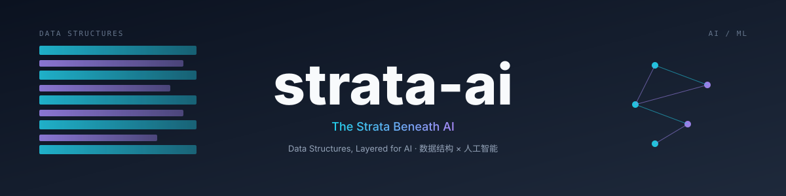

# strata-ai

> **The Strata Beneath AI**
> *Data Structures, Layered for AI*
> 数据结构 × 人工智能

 

{ loading=lazy }

---

## 这是什么

**strata-ai** 是一个面向开发者与学习者的开源项目，专注于 **数据结构（Data Structures）与人工智能（AI）算法的结合**。

我们不重复造"教科书轮子"，而是回答一个具体的问题：

> **每一种经典数据结构，分别在 AI/ML 系统里扮演什么角色？**

堆支撑 Beam Search，树支撑决策树，图支撑 GNN，哈希支撑 Attention —— 这些连接，本项目一一摊开。

## 阅读路径

- 🆕 **零基础** → 从 [项目总览](01-overview.md) 开始
- 🧑‍💻 **AI 工程师** → 直接跳到 [完整目录](目录.md) 选章节
- 💼 **面试突击** → 关注 `目录.md` 里的「高频考点」标签

## 项目地址

- 仓库：[github.com/huifer/strata-ai](https://github.com/huifer/strata-ai)
- Issue：[提交问题](https://github.com/huifer/strata-ai/issues)
- 贡献：[CONTRIBUTING.md](https://github.com/huifer/strata-ai/blob/main/CONTRIBUTING.md)
- 许可：[MIT](https://github.com/huifer/strata-ai/blob/main/LICENSE)

---

Made with ❤️ by [huifer](https://github.com/huifer)